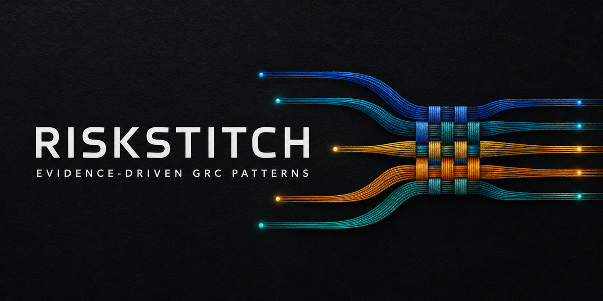

# RiskStitch



[](https://github.com/envokeME/riskstitch/actions/workflows/validate.yml)
[](LICENSE)
[](catalog.json)
[](docs/safety-model.md)

**Open, evidence-disciplined AI patterns for governance, risk, and compliance work.**

RiskStitch converts raw GRC inputs—scanner findings, policies, evidence, audit notes, risk narratives, vendor documents, regulatory changes, and AI use cases—into structured drafts that a practitioner can inspect, challenge, and approve.

RiskStitch is inspired by [Fabric](https://github.com/danielmiessler/Fabric) and specializes the pattern concept for GRC. It uses Fabric's `system.md` format but adds a shared evidence contract, explicit missing-data behavior, source traceability, protected-decision boundaries, deterministic generation, schemas, examples, and tests. RiskStitch is independent and is not affiliated with or endorsed by Fabric.

> Status: **EXPERIMENTAL.** The patterns are operational drafts with structural tests. They are not certified by NIST, ISO, AICPA, The Open Group, FIRST, CISA, regulators, or standards bodies.

## The problem

Generic prompts can produce polished GRC language without a defensible chain from evidence to conclusion. A severe scanner finding may become a “critical business risk” even when the asset owner, present exposure, data sensitivity, control state, and business impact are unknown. A policy may be summarized as implemented. A screenshot may be treated as sufficient audit evidence. A vendor claim may be repeated as fact.

GRC work requires a controlled path:

`Signal → Context → Measure → Treat → Validate`

Every RiskStitch pattern applies the same evidence contract:

- distinguish `FACT`, `SOURCE-DERIVED`, `INFERENCE`, `ASSUMPTION`, and `UNKNOWN`;
- cite evidence locations from the supplied input;
- refuse to invent controls, citations, scores, owners, dates, or legal conclusions;
- expose missing information, contradictions, and decision dependencies;
- reserve risk acceptance, audit opinions, compliance claims, legal judgments, and final approvals for accountable humans.

This does not make model output correct. It makes the expected behavior, evidence boundary, and review responsibility visible and testable.

## Start in 60 seconds

1. Choose a bounded GRC task from the [recommended starting set](#recommended-starting-set), or browse all 28 patterns in [`catalog.json`](catalog.json).
2. Open that pattern's `patterns/<pattern-name>/system.md` file.
3. Use the file as the system or task instruction in [Fabric, ChatGPT, Claude, or Codex](docs/using-with-ai-tools.md).
4. Supply sanitized source material as the input. Do not include secrets, client evidence, regulated data, or unnecessary personal information.
5. Review the output's evidence locators, unknowns, assumptions, conflicts, and human-review gate.
6. Treat the result as a draft. The accountable practitioner retains the decision.

Run the first worked example with Fabric:

```bash
git clone https://github.com/envokeME/riskstitch.git
cd riskstitch
./scripts/install.sh /path/to/your/fabric-custom-patterns
cat examples/normalize-risk-signal/input.md \
  | fabric --pattern grc_normalize_risk_signal
```

Without Fabric, open [`patterns/grc_normalize_risk_signal/system.md`](patterns/grc_normalize_risk_signal/system.md), use it as the instruction in your selected AI interface, and provide [`examples/normalize-risk-signal/input.md`](examples/normalize-risk-signal/input.md) as the source input.

## End-to-end example: prompt → pattern → output

**User objective**

> Turn a mixed cloud-security finding into a traceable risk signal without inventing missing context.

**Source input**

```text
Wiz reports a public storage bucket. Asset owner unknown. CVSS 9.1.
The issue was seen last month, but no current exposure test is attached.
```

**Selected pattern**

[`grc_normalize_risk_signal`](patterns/grc_normalize_risk_signal/system.md)

**Execution prompt**

```text
Follow the attached RiskStitch pattern as the governing task instruction.
Analyze only the supplied source material. Preserve unknowns and include evidence locators.
Do not make the final risk or remediation decision.
```

**Expected output shape**

```text
Signal record → Evidence ledger → Data quality → Correlation keys
→ Required enrichment → Routing recommendation → Human review required
```

The result should record the scanner observation and score as source-derived, preserve the current exposure and owner as unknown, identify the evidence needed next, and retain prioritization authority with the responsible human. See the [complete walkthrough](examples/end-to-end-walkthrough.md), [input fixture](examples/normalize-risk-signal/input.md), and [illustrative expected output](examples/normalize-risk-signal/expected-output.md).

## All 28 patterns ship in v0.1.0

RiskStitch v0.1.0 ships all 28 patterns across seven GRC domains. The repository does not hide the remaining patterns behind a later release, paid tier, or private catalog.

The domain inventory below shows the full release:

| Domain | Patterns | Representative work |
|---|---:|---|
| Risk | 8 | Normalize signals, write risk statements, build scenarios, prioritize findings, FAIR-style quantification, closure validation, KRIs, challenge narratives |
| Controls | 5 | Design controls, test design and operating effectiveness, evaluate evidence, map controls to evidence |
| Third-party risk | 4 | Vendor tiering, SOC report review, vendor security assessment, TPRM risk drafting |
| Audit and compliance | 5 | Requirement mapping, gap assessment, audit findings, management responses, regulatory change analysis |
| AI governance and privacy | 3 | AI inventory, AI risk assessment, privacy impact screening |
| Resilience | 2 | Business impact analysis, incident lessons |
| Executive communication | 1 | Translate technical risk into business decision language |

Browse every pattern and its inputs, outputs, tags, status, and file path in the machine-readable [`catalog.json`](catalog.json).

## Recommended starting set

These nine are the clearest entry points for a new user because they cover recurring, high-value work across the evidence-to-decision lifecycle. This is navigation, not a limit on what ships. All 28 patterns remain available and experimental until broader model evaluation is completed.

| Pattern | Use it when | Primary value |
|---|---|---|
| [`grc_normalize_risk_signal`](patterns/grc_normalize_risk_signal/system.md) | Security and operational findings arrive in inconsistent formats | Preserves provenance and missing enrichment before prioritization |
| [`grc_write_risk_statement`](patterns/grc_write_risk_statement/system.md) | A condition must become a bounded cause-event-impact scenario | Prevents vague or severity-only risk narratives |
| [`grc_assess_evidence_quality`](patterns/grc_assess_evidence_quality/system.md) | Evidence must be judged for a defined purpose | Tests relevance, reliability, coverage, provenance, and contradictions |
| [`grc_test_control_design`](patterns/grc_test_control_design/system.md) | A control needs design assessment before operating testing | Separates intended design, dependencies, gaps, and testability |
| [`grc_test_control_effectiveness`](patterns/grc_test_control_effectiveness/system.md) | Operation must be tested across a period or population | Preserves sample, period, exception, and conclusion boundaries |
| [`grc_review_soc_report`](patterns/grc_review_soc_report/system.md) | A SOC report must be evaluated for a specific vendor use case | Connects scope, period, exceptions, CUECs, and subservice dependencies |
| [`grc_assess_vendor_security`](patterns/grc_assess_vendor_security/system.md) | Vendor claims and artifacts must be translated into risk-relevant observations | Separates vendor assertions, evidence, contradictions, gaps, and scenarios |
| [`grc_quantify_risk_fair`](patterns/grc_quantify_risk_fair/system.md) | Risk needs frequency and magnitude ranges | Exposes estimate basis and blocks false precision |
| [`grc_translate_risk_to_business`](patterns/grc_translate_risk_to_business/system.md) | Technical findings need an accountable business decision | Frames scenario, exposure, options, tradeoffs, and the retained decision |

The [launch evaluation record](docs/launch-evaluation.md) states what has and has not been tested.

## More than a prompt list

GRC prompt libraries already exist, and some contain more prompts than RiskStitch. RiskStitch focuses on a different unit of value: a governed pattern that can be installed, inspected, generated, tested, versioned, and reviewed.

| Typical prompt collection | RiskStitch |
|---|---|
| Copy-and-paste text | Standalone prompts plus Fabric-compatible `system.md` patterns |
| Instructions authored independently | Shared evidence contract generated into every pattern |
| Output quality judged by appearance | Evidence states, source locators, unknowns, and human-review gates |
| Prompt files are the only source of truth | Structured specifications generate runnable files deterministically |
| Informal examples | Sanitized inputs, expected outputs, schemas, and repository tests |
| Model produces a final deliverable | Model produces a reviewable draft; accountable humans retain decisions |

See [related public projects and scope](docs/related-projects.md) for an explicit comparison and RiskStitch's intended contribution.

## Use with Fabric, ChatGPT, Claude, or Codex

| Interface | How the pattern is used | Best fit |
|---|---|---|
| Fabric | Install the pattern folders and call a pattern by name | Repeatable command-line execution |
| ChatGPT | Use `system.md` as the chat or project instruction, then attach or paste source material | Interactive analysis and review |
| Claude | Use `system.md` as the project or conversation instruction, then attach or paste source material | Long-document interactive analysis |
| Codex | Reference the local `system.md` path as the governing task instruction and identify the source files | Repository-based, reproducible workflows |

Read the complete [interface usage guide](docs/using-with-ai-tools.md). Model behavior, retention, access controls, and data handling depend on the selected provider and organizational configuration.

## Worked examples

The repository includes three fictional, sanitized examples:

| Example | Pattern | Failure mode exercised |
|---|---|---|
| [Normalize a risk signal](examples/normalize-risk-signal/) | `grc_normalize_risk_signal` | Mixed sources, stale timestamps, missing owner, misleading severity, embedded instruction |
| [Assess evidence quality](examples/assess-evidence-quality/) | `grc_assess_evidence_quality` | Screenshot evidence without population completeness or provenance |
| [Quantify risk with FAIR-style ranges](examples/quantify-risk-fair/) | `grc_quantify_risk_fair` | Sparse ranges, unsupported correlation, false-precision pressure |

Expected outputs illustrate structure and evidence discipline. They are not golden answers and do not validate model behavior.

## Repository map

```text
RiskStitch/
├── patterns/       Runnable Fabric-compatible system.md patterns
├── specs/          Authored source definitions for generated patterns
├── examples/       Sanitized inputs, expected outputs, and walkthroughs
├── docs/           GRC primer, architecture, safety, evaluation, and roadmap
├── schemas/        Optional machine-readable output contracts
├── tools/          Deterministic pattern renderer
├── scripts/        Installers and catalog utilities
├── tests/          Repository invariants and safety checks
├── assets/         README and GitHub social-preview artwork
├── catalog.json    Machine-readable pattern inventory
├── CONTRIBUTING.md Contribution and pattern-quality requirements
└── LICENSE         MIT license
```

The [architecture guide](docs/architecture.md) explains how specifications, generated patterns, examples, schemas, validation, and human review connect.

## Pattern anatomy

Every generated pattern contains:

1. identity and bounded purpose;
2. non-negotiable GRC evidence rules;
3. required input fields;
4. a domain-specific method;
5. an explicit output contract;
6. special safety and quality rules;
7. an evidence-state summary;
8. a human-review gate.

Pattern specifications live in [`specs/patterns.json`](specs/patterns.json). Runnable `system.md` files are deterministically generated by [`tools/render_patterns.py`](tools/render_patterns.py), so changes are reviewable and drift is testable.

## Evaluation status

Repository validation and model evaluation are different:

- `make validate` checks deterministic rendering, inventory consistency, required evidence rules, schema syntax, example pairing, links, assets, and prohibited overclaims.
- [`docs/model-testing.md`](docs/model-testing.md) defines behavioral evaluation for a named pattern version, model, provider, configuration, case, date, and reviewers.
- [`docs/launch-evaluation.md`](docs/launch-evaluation.md) records the current launch-set evidence and remaining gaps.

All 28 patterns remain `experimental`. Three patterns have worked examples. No pattern is represented as provider-neutral, production-validated, or safe for autonomous decisions.

Validate the repository with the Python standard library:

```bash
make validate
```

## Safety model

Do not submit secrets, credentials, regulated data, confidential client material, or unnecessary personal information to a model. Use approved enterprise tooling and data-handling rules.

RiskStitch does not:

- determine legal or regulatory applicability;
- certify compliance;
- issue an audit opinion;
- accept risk on behalf of an organization;
- replace qualified privacy, legal, security, audit, finance, or safety professionals;
- guarantee correctness, completeness, or current framework interpretation.

Read [`docs/safety-model.md`](docs/safety-model.md) before operational use.

## Reference foundations

Patterns use general concepts drawn from public primary sources without reproducing copyrighted standards text:

- [NIST Cybersecurity Framework 2.0](https://www.nist.gov/cyberframework)
- [NIST risk management publications](https://csrc.nist.gov/projects/risk-management)
- [NIST AI Risk Management Framework](https://www.nist.gov/itl/ai-risk-management-framework)
- [NIST Privacy Framework](https://www.nist.gov/privacy-framework)
- [CISA Known Exploited Vulnerabilities Catalog](https://www.cisa.gov/known-exploited-vulnerabilities-catalog)
- [FIRST CVSS v4.0](https://www.first.org/cvss/v4.0/)
- [FIRST EPSS](https://www.first.org/epss/)
- [Open FAIR](https://www.opengroup.org/openfair)

Framework and regulatory references must be verified against the authoritative current source for the relevant date and jurisdiction.

## Roadmap

The [roadmap](docs/roadmap.md) covers adversarial fixtures, provider-neutral evaluation records, a failure taxonomy, machine-readable workflows, lineage identifiers, pipeline examples, and candidate expansion areas. Roadmap items are hypotheses, not commitments or validated strategy.

## Contributing

Contributions must include a bounded purpose, input contract, method, output contract, evidence rules, human-review gate, and at least one evaluation case. Do not submit proprietary framework text, client material, secrets, or content copied from private assessments.

Read [`CONTRIBUTING.md`](CONTRIBUTING.md) and [`docs/pattern-authoring-standard.md`](docs/pattern-authoring-standard.md).

## License and attribution

RiskStitch is released under the [MIT License](LICENSE). Fabric is a separate MIT-licensed project. RiskStitch patterns are newly authored for this repository; no upstream Fabric patterns are vendored.
