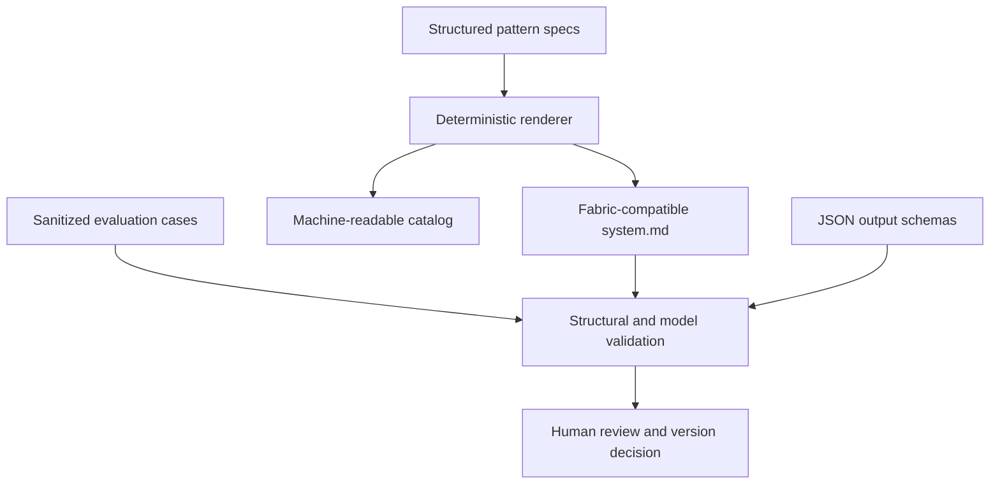

# Architecture

RiskStitch separates authored specifications, generated prompts, examples, schemas, and validation.

## Runtime boundary

The repository contains no model client, provider integration, API key handling, database, telemetry, or remote service. Fabric or another AI client supplies runtime execution.

## Source of truth

- `specs/patterns.json`: authored pattern definitions.
- `tools/render_patterns.py`: shared evidence contract and deterministic renderer.
- `patterns/*/system.md`: generated runnable patterns.
- `catalog.json`: generated inventory.
- `schemas/`: optional downstream data contracts.
- `examples/`: sanitized illustrative cases.
- `tests/`: repository invariants.

## Change path

Specification change → render → review generated diff → structural validation → model evaluation → maintainer status decision.
