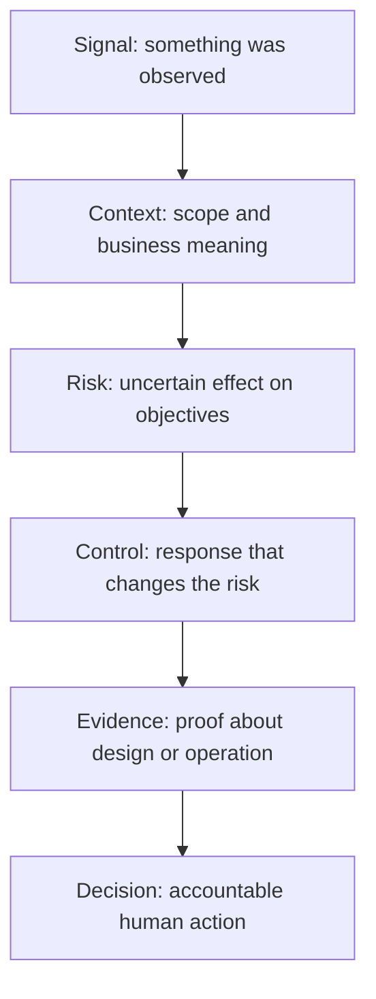

# GRC in plain English

This guide explains the mental model behind RiskStitch. It is written for people who are new to governance, risk, compliance, audit, or security assurance.

## The short version

Think of an organization as a vehicle making a journey.

- **Governance** decides the destination, who may steer, and which rules cannot be ignored.
- **Risk management** asks what could prevent the journey, how serious it could be, and what to do about it.
- **Compliance** checks which external and internal requirements apply to the journey.
- **Controls** are the brakes, guardrails, maintenance routines, and warning lights.
- **Evidence** shows whether those controls exist and worked when they were needed.
- **Audit and assurance** independently test whether the story matches the evidence.

GRC is not paperwork for its own sake. It is a decision system for uncertainty, accountability, and proof.

## The chain RiskStitch follows



Skipping a step causes common GRC errors. A vulnerability score becomes a risk rating. A policy statement is mistaken for a working control. A screenshot is treated as proof for an entire year. An AI-generated recommendation quietly becomes a business decision.

## Six concepts that prevent most mistakes

### 1. A signal is not yet a risk

A signal is an observation or claim that deserves attention: a scanner finding, a failed test, a vendor response, an audit note, or a regulatory update.

A risk describes uncertainty and its possible effect on an objective. It needs context:

- what valuable objective or asset is involved;
- what event could occur;
- what conditions make the event plausible;
- what harm could result;
- which controls change likelihood or impact;
- what remains unknown.

**Common mistake:** “CVSS 9.1 means critical business risk.” CVSS describes technical severity characteristics. Business risk also depends on exposure, asset importance, threat activity, control strength, and consequences.

Use [`grc_normalize_risk_signal`](../patterns/grc_normalize_risk_signal/system.md) before deciding how a raw signal should be routed.

### 2. A policy is not a control

A policy states intent or a rule. A control is a specific action or mechanism intended to change risk.

“Privileged access must be reviewed” is a policy statement. A review control needs more detail:

- who performs it;
- what population is reviewed;
- how often it occurs;
- what criteria are applied;
- what happens when an exception is found;
- what evidence is retained.

Use [`grc_design_control`](../patterns/grc_design_control/system.md) to turn a risk-treatment idea into a testable control draft.

### 3. Control design and control operation are different questions

**Design effectiveness** asks: if the control operates as described, is it capable of addressing the stated risk?

**Operating effectiveness** asks: did the control actually operate, for the required population and period, with exceptions handled correctly?

A perfectly designed quarterly access review that never happened is not operating effectively. A review performed every quarter may still be poorly designed if it omits service accounts.

Use [`grc_test_control_design`](../patterns/grc_test_control_design/system.md) and [`grc_test_control_effectiveness`](../patterns/grc_test_control_effectiveness/system.md) for the two distinct tests.

### 4. Evidence must support the exact claim

Evidence is not strong merely because it looks official. Its value depends on the claim being tested.

Ask:

- **Relevance:** does it address this control and assertion?
- **Reliability:** who or what produced it, and can it be altered?
- **Period:** does it cover the date or time window being assessed?
- **Population:** does it cover all relevant items or only a convenient sample?
- **Provenance:** can a reviewer trace it to its source?
- **Consistency:** does another source contradict it?

A screenshot of one successful backup may prove that one backup appeared successful at one moment. It does not prove that all required backups completed throughout a year.

Use [`grc_assess_evidence_quality`](../patterns/grc_assess_evidence_quality/system.md) to test whether evidence is fit for the intended conclusion.

### 5. Compliance and risk are related, not identical

Compliance asks whether stated criteria are met. Risk asks how uncertainty could affect objectives.

An organization can be compliant with a minimum requirement and still carry material risk. It can also have a control gap without enough evidence to determine the resulting risk. Keep the questions separate, then connect them explicitly.

Use [`grc_map_requirement_to_control`](../patterns/grc_map_requirement_to_control/system.md) for traceability and [`grc_build_gap_assessment`](../patterns/grc_build_gap_assessment/system.md) for a scoped gap analysis.

### 6. AI may support a decision; it does not own the decision

Risk acceptance, legal interpretation, audit opinions, vendor approval, finding closure, and production approval require accountable human authority. A model can organize evidence, expose gaps, perform bounded analysis, and draft options. It cannot become the risk owner, auditor, regulator, lawyer, or executive approver.

Every RiskStitch pattern ends with a human-review gate to make that boundary visible.

## Worked example: a public storage bucket

### Raw input

```text
The cloud scanner reports that storage bucket customer-export-prod is public.
The finding has a 9.1 severity score and was first seen last month.
No current exposure test is attached. The asset owner is unknown.
```

### Step 1: separate evidence states

| State | Meaning | Example |
|---|---|---|
| `FACT` | Directly observed in supplied input | The supplied record contains a 9.1 score. |
| `SOURCE-DERIVED` | Asserted by a supplied source | The scanner reports that the bucket is public. |
| `INFERENCE` | Reasoned interpretation | Public exposure could increase unauthorized-access likelihood. |
| `ASSUMPTION` | Provisional, unverified input | The bucket may contain customer exports, based only on its name. |
| `UNKNOWN` | Required information is missing | Current exposure, data classification, owner, access logs, and compensating controls. |

`SOURCE-DERIVED` does not mean false. It means the source made the claim and a reviewer can see what still needs verification.

### Step 2: write a conditional risk scenario

> If the bucket is currently public and contains sensitive customer data, an unauthorized party could retrieve that data, causing confidentiality harm, notification costs, customer impact, and possible regulatory consequences.

The words “if” and “could” matter. They preserve uncertainty rather than disguising it.

### Step 3: identify decision-changing evidence

The next useful evidence is not another polished summary. It is evidence that could change the decision:

1. a current configuration result from an authoritative cloud source;
2. the bucket's data classification and sample inventory;
3. ownership and business purpose;
4. access logs for the relevant period;
5. public-access-block and identity-policy configuration;
6. any validated compensating controls;
7. threat or exposure evidence relevant to the time window.

### Step 4: route, do not overclaim

The draft may recommend immediate validation and containment under existing incident or exposure procedures. It should not claim a breach occurred, calculate unsupported loss, declare noncompliance, or accept residual risk.

## Choose a pattern by the question you need answered

| Your question | Start with |
|---|---|
| “What exactly did this source tell us?” | [`grc_normalize_risk_signal`](../patterns/grc_normalize_risk_signal/system.md) |
| “Can we write a defensible risk statement?” | [`grc_write_risk_statement`](../patterns/grc_write_risk_statement/system.md) |
| “What event and loss scenario are we analyzing?” | [`grc_build_risk_scenario`](../patterns/grc_build_risk_scenario/system.md) |
| “Which findings deserve attention first?” | [`grc_prioritize_security_findings`](../patterns/grc_prioritize_security_findings/system.md) |
| “Is this control designed well?” | [`grc_test_control_design`](../patterns/grc_test_control_design/system.md) |
| “Did the control operate over the period?” | [`grc_test_control_effectiveness`](../patterns/grc_test_control_effectiveness/system.md) |
| “Is this evidence good enough for the claim?” | [`grc_assess_evidence_quality`](../patterns/grc_assess_evidence_quality/system.md) |
| “What does this requirement map to?” | [`grc_map_requirement_to_control`](../patterns/grc_map_requirement_to_control/system.md) |
| “What should an audit finding say?” | [`grc_draft_audit_finding`](../patterns/grc_draft_audit_finding/system.md) |
| “What can we conclude from this SOC report?” | [`grc_review_soc_report`](../patterns/grc_review_soc_report/system.md) |
| “How should we assess this vendor?” | [`grc_assess_vendor_security`](../patterns/grc_assess_vendor_security/system.md) |
| “How do we explain this to an executive?” | [`grc_translate_risk_to_business`](../patterns/grc_translate_risk_to_business/system.md) |

Run `python3 scripts/list-patterns.py` to view the complete catalog.

## What good input looks like

A model can only analyze the boundary you provide. Strong input identifies:

- the purpose of the analysis;
- the organization, process, system, or vendor in scope;
- the relevant period and dates;
- the source documents and evidence locators;
- the criteria or framework version, when applicable;
- known facts, disagreements, and missing items;
- the accountable reviewer and decision owner;
- data classification and handling restrictions.

Do not add confidential material merely to make the prompt look complete. Minimize data and use an approved model environment.

## How to review an AI-generated GRC draft

Before relying on an output, ask five questions:

1. **Can I trace every material claim to supplied evidence?**
2. **Are fact, source claim, inference, assumption, and unknown kept separate?**
3. **Could missing or contradictory evidence reverse the conclusion?**
4. **Were calculations, populations, dates, scope, and framework versions independently checked?**
5. **Is the final decision still assigned to an authorized person?**

If any answer is “no,” the draft is not ready for a decision.

## Where to go next

- Try the [normalization example](../examples/normalize-risk-signal/).
- Read the [safety model](safety-model.md) before operational use.
- Review [framework and source boundaries](framework-boundaries.md) before making framework claims.
- Use the [model-testing protocol](model-testing.md) before treating a pattern as reliable in your environment.
